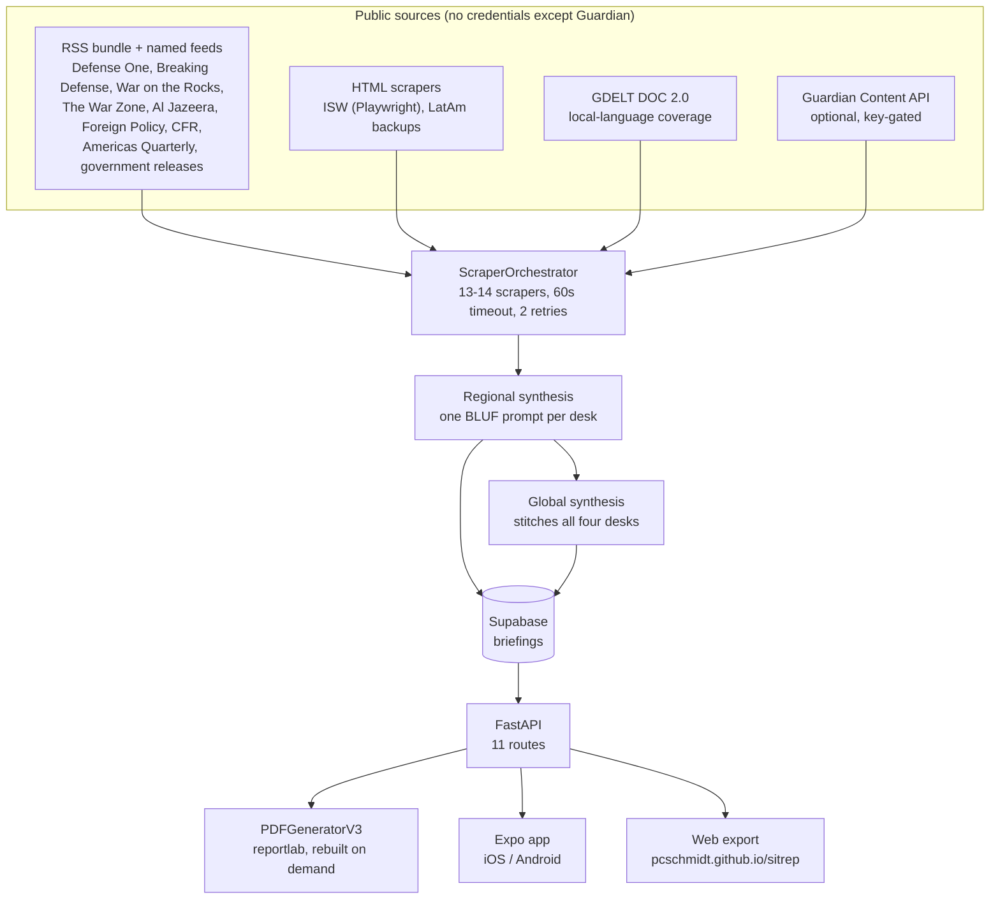

# SITREP — daily geopolitical intelligence briefings

**Live app: https://pcschmidt.github.io/sitrep/** (the web build of the mobile app;
keyboard and mouse work, and the PDF buttons open the same briefings).
**API: https://sitrep-production-6aac.up.railway.app** — backend v0.21.10, `uvicorn main:app`
from `api/` on Railway. Legal pages: [privacy](https://pcschmidt.github.io/sitrep/privacy-policy),
[terms](https://pcschmidt.github.io/sitrep/terms).

## What is this? (plain-language overview)

SITREP answers one question every morning: *what actually changed in the world's trouble
spots, and what does it mean?* It scrapes open defense, economic, and think-tank
publications, sorts the results into four regional desks, and writes each desk a briefing
in **BLUF** (Bottom Line Up Front) format — the structure military intelligence products
use: the conclusion first, then the evidence, then the outlook.

You open the app, pick a desk (Middle East, Indo-Pacific, Europe/Africa, Western
Hemisphere), or read **Global**, which stitches all four together in full. Each briefing
carries a BLUF paragraph, key developments, per-section analysis with source links, and an
outlook. Every desk has a PDF that is generated from the same briefing JSON the app
displays.

The thing that makes it more than a news summarizer:

- **The briefing is built from fetched text, not model memory.** Thirteen scrapers run in
  parallel over public RSS feeds, Hacker-free HTML pages, GDELT DOC 2.0, and government
  press releases; each has a 60-second per-attempt timeout and two retries, so one dead
  source cannot stall the run. Every claim in a section carries the URL it came from.
- **One synthesis pass per desk, with an explicit model waterfall.** A single prompt per
  desk turns the day's articles into the BLUF product; if the primary model returns empty
  content, is rate limited, or runs out of credits, the client falls through to the next
  model and records which one actually wrote the briefing in `metadata.model_used`.
- **The briefings are durable; the PDFs are reproducible.** Briefings are stored in
  Supabase, so a container restart no longer empties the app (it used to — this was the
  2026-09-12 outage). PDFs are deliberately *not* stored: `GET /briefing/latest/pdf`
  re-renders one from the current briefing JSON whenever the cached file is missing or
  older than the briefing, and serves it inline.
- **One codebase, two surfaces.** Expo / React Native ships the phone app; the same app
  exports to the web build above. The PDF viewer is the only platform fork: an iframe on
  web, `react-native-pdf` on device.

| | |
| --- | --- |
| Live app | https://pcschmidt.github.io/sitrep/ (Expo web export, baseUrl `/sitrep`) |
| API | https://sitrep-production-6aac.up.railway.app — v0.21.10, 11 routes |
| Desks | Middle East, Indo-Pacific, Europe/Africa, Western Hemisphere, plus composite Global |
| Sources | 13 scrapers by default; 14 with a `GUARDIAN_API_KEY` (adds the Guardian Content API) |
| Model | `deepseek/deepseek-v4-flash`, waterfall to `deepseek/deepseek-v3.2`, then `moonshotai/kimi-k2.5` |
| Cost | ~$0.001 per regional briefing (~$0.15/month at one run a day), plus Railway hosting |
| Last verified run | 2026-09-12 15:24–15:26 UTC — 30 articles per desk, 120-article Global, 17 sections |
| Storage | Supabase Postgres for briefings; PDFs are container-disk cache only |
| Tests | `cd api && pytest tests -q` — 11 passing, offline, no keys needed |
| Release status | Google Play closed testing next (20 testers / 14 days), then production, then App Store |

## Architecture at a glance



The whole backend is `api/main.py` plus the `scrapers/`, `synthesis/`, `pdf_generation/`
and `database/` packages. There is no queue and no worker fleet: `POST /pipeline/run-weekly`
runs the job in the API process under an in-process lock, and APScheduler fires the same
job daily at 06:00 UTC.

## Quickstart

Backend (Python 3.11+):

```bash
cd api
pip install -r requirements.txt
cp .env.example .env          # then fill in the keys below
uvicorn main:app --reload     # http://localhost:8000/docs
```

`.env` needs `OPENROUTER_API_KEY`, `SUPABASE_URL`, `SUPABASE_KEY`. Add
`SUPABASE_SERVICE_KEY` (the Supabase secret key) if you want the pipeline to write
briefings — the publishable key is blocked by row-level security. `GUARDIAN_API_KEY` is
optional and only enables the fourteenth scraper. See [DEPLOYMENT.md](DEPLOYMENT.md).

Mobile and web app:

```bash
cd mobile
npm install
npx expo start                # then: i (iOS), a (Android), or w (web)
```

Trigger a briefing run against a running API (about 20 minutes, so do not wait on the
connection):

```bash
curl -X POST https://sitrep-production-6aac.up.railway.app/pipeline/run-weekly --max-time 10
# client times out by design; poll the desks until generated_at is today:
curl "https://sitrep-production-6aac.up.railway.app/briefing/latest?region=Middle%20East"
```

## Approach: why it is built this way

- **BLUF, because that is the product.** Summaries that start with background waste the
  reader's first ten seconds. The prompt asks for the conclusion first, and the app renders
  it that way: BLUF, key developments, sections with sources, outlook.
- **Scrape widely, synthesize once per desk.** Thirteen narrow scrapers are easier to fix
  than one clever crawler; each is a small class over a stable interface, so a dead feed is
  a one-file change and shows up in the pipeline response as `articles: 0` rather than as a
  silent gap in a briefing.
- **Store what is expensive, recompute what is cheap.** The LLM pass costs money and
  cannot be replayed, so briefings go to Supabase. The PDF is deterministic from the
  briefing, so it is cached on disk and rebuilt whenever it is stale, missing, or lost to a
  redeploy. That is why a container restart cannot break the app any more.
- **A model waterfall instead of a retry loop.** Free-tier and pay-as-you-go models fail
  in different ways (empty content, rate limit, insufficient credits). Falling through to a
  cheaper-to-dearer chain, and recording `model_used`, keeps the pipeline green and the
  provenance honest.
- **The guard is opt-in.** Write and debug endpoints accept `X-Admin-Token`. While
  `SITREP_ADMIN_TOKEN` is unset the API logs a warning per request and allows it, so an
  existing deployment never locks itself out during a rollout.

## Method (what the pipeline actually does)

1. **Scrape.** `ScraperOrchestrator.scrape_all_sources(days=7)` runs every scraper in
   parallel with `asyncio.gather`, each wrapped in a 60-second timeout and two retries.
   Failures are logged per source and returned as an empty list; the run continues.
2. **Group and trim.** Articles are deduplicated into the four desks and capped per desk
   (30 articles in the 2026-09-12 run).
3. **Synthesize.** One BLUF prompt per desk through
   `api/synthesis/openrouter_client.py`, recording `model_used`, token counts, and a cost
   estimate in each briefing's `metadata`. `POST /synthesize/global` then stitches the four
   finished briefings into the Global product (17 sections, 120 articles).
4. **Stamp and store.** Each briefing is written to Supabase with `generated_at` set by the
   server. Both `/synthesize` and `/synthesize/global` stamp it, not just the pipeline —
   a briefing without a parseable timestamp used to crash the client.
5. **Serve.** `GET /briefing/latest`, `GET /briefing/global`, and
   `GET /briefing/latest/pdf`. The PDF route loads the newest briefing (Supabase first,
   `data/briefings/*.json` fallback), regenerates via `PDFGeneratorV3` when needed, caches
   to `data/pdfs/{slug}_{YYYY-MM-DD}.pdf`, and returns
   `Content-Disposition: inline; filename="..."` so browsers render it instead of
   downloading it.

## Results

Verified against production on 2026-09-12; regenerate any of it with the commands in
[Verify the claims](#verify-the-claims-a-reviewers-path).

| Desk | Articles | Sections | Model | Tokens |
| --- | --- | --- | --- | --- |
| Middle East | 30 | 4 | DeepSeek V4 Flash | 11,658 |
| Indo-Pacific | 30 | 6 | DeepSeek V4 Flash | 14,323 |
| Europe/Africa | 30 | 3 | DeepSeek V4 Flash | 10,643 |
| Western Hemisphere | 30 | 4 | DeepSeek V4 Flash | 16,682 |
| Global (composite) | 120 | 17 | — (stitched) | — |

- One full run produced all five briefings end to end in under 20 minutes (scrape, then one
  synthesis pass per desk), at a stated cost of ~$0.001 per regional briefing.
- All five briefings and all five PDFs returned `200` over HTTP; the web app rendered every
  desk tab and every PDF page in a desktop browser.
- `api/tests/` covers the admin-token guard and Supabase key selection: 11 tests, offline.

## Limitations

- **No evaluator.** Nothing checks a briefing against its sources before it ships. SITREP
  has the chokepoint-style trust boundary nowhere: the model writes what it writes, and the
  source links are the only way for a reader to audit it. That is the biggest gap between
  this project and the rest of the portfolio.
- **Scraped text quality is the ceiling.** Feed summaries and article extracts are uneven;
  a thin or paywalled day produces a thinner briefing, and the app cannot tell the
  difference between "quiet news day" and "feed broke". Scrapers do not consult
  `robots.txt` today, do not set a descriptive `User-Agent` in the production paths, and
  there is no politeness delay beyond parallelism limits — fix before scaling sources.
- **One model, three vendors of one family.** The waterfall is DeepSeek first with a Kimi
  fallback; a shared failure mode (for example, a prompt-injection-laden article) is not
  mitigated.
- **The pipeline is in-process.** A redeploy during a run kills the run; there is no queue,
  no resumability, and no per-run history beyond the briefings themselves.
- **Unauthenticated operations.** `SITREP_ADMIN_TOKEN` is not set in production, so the
  pipeline, debug, and upload endpoints are open. Treat that as a known, dated gap.
- **PDF cache is ephemeral.** Only the container disk holds PDFs; object storage would be
  needed for a real archive.
- **Not in any store yet.** Google Play closed testing is next; today the app is a web
  build, a local run, and an APK/AAB built with EAS.

## Operational notes

### Deploy targets

| Target | What runs | How it deploys |
| --- | --- | --- |
| Railway | FastAPI + APScheduler, `uvicorn main:app` from `api/` | push to `main`, or change a service variable |
| GitHub Pages (portfolio repo) | the Expo web export | push to the portfolio repo's `master`, which builds SITREP `main` into `public/sitrep/` |
| Local | API on `:8000`, Expo dev server | `uvicorn main:app --reload`, `npx expo start` |

The web app is deliberately hosted from the portfolio repo, not this one: GitHub Pages
paths are case-sensitive, and `PCSchmidt/SITREP` would serve `/SITREP/`. The store listings
point at `/sitrep/privacy-policy` and `/sitrep/terms`, which live in that repo too.

Any push to `main` or variable change redeploys the Railway container. That used to cost
about twenty minutes of broken app; now briefings are in Supabase and PDFs regenerate, so
a redeploy is only a warm-up. Full detail in [DEPLOYMENT.md](DEPLOYMENT.md) and
[DEPLOYMENT_CONFIG.md](DEPLOYMENT_CONFIG.md).

### Data and keys

| Variable | Purpose |
| --- | --- |
| `OPENROUTER_API_KEY` | model access for synthesis |
| `SUPABASE_URL`, `SUPABASE_KEY` | reads (publishable key) |
| `SUPABASE_SERVICE_KEY` | writes; the publishable key fails with RLS error `42501` |
| `GUARDIAN_API_KEY` | optional; enables the Guardian Content API scraper |
| `SITREP_ADMIN_TOKEN` | optional; when set, write/debug endpoints require `X-Admin-Token` |

The backend pins `supabase==2.31.0`: the client must be 2.16.0 or newer to accept the new
`sb_secret_...` secret key format at all. `GET /debug/supabase` reports
`storage`, `key_role`, `client_initialized`, and the regional briefing count — check
`key_role: service_role` after any key rotation. Never in the repo, never in a log.

### Verify the claims (a reviewer's path)

```bash
# backend tests, offline (pass `tests` explicitly: a bare pytest from api/ also
# collects the ad-hoc scripts in api/scripts/ and aborts on six collection errors)
cd api && pytest tests -q                            # 11 passed

# is production healthy, and which key is it using?
curl https://sitrep-production-6aac.up.railway.app/debug/supabase

# are the desks current?
for r in "Middle East" "Indo-Pacific" "Europe/Africa" "Western Hemisphere"; do
  curl -s -G "https://sitrep-production-6aac.up.railway.app/briefing/latest" --data-urlencode "region=$r"
done
curl -s https://sitrep-production-6aac.up.railway.app/briefing/global

# do the PDFs render?
curl -sI -G "https://sitrep-production-6aac.up.railway.app/briefing/latest/pdf" \
  --data-urlencode "region=Middle East" | grep -i content-type
```

Then open https://pcschmidt.github.io/sitrep/ and click through all five tabs and one PDF.

### Documentation map

| Doc | What it covers |
| --- | --- |
| [SPEC.md](SPEC.md) | what the product is, feature by feature |
| [CONTRACT.md](CONTRACT.md) | API surface and data contracts |
| [DESIGN_SYSTEM.md](DESIGN_SYSTEM.md) | visual language, typography, BLUF layout |
| [DEPLOYMENT.md](DEPLOYMENT.md) / [DEPLOYMENT_CONFIG.md](DEPLOYMENT_CONFIG.md) | production topology, variables, runbooks |
| [PLANS.md](PLANS.md) / [VERSION_ROADMAP.md](VERSION_ROADMAP.md) / [FUTURE_VISION.md](FUTURE_VISION.md) | shipped, planned, and speculative |
| [DECISIONS.md](DECISIONS.md) | dated architecture decisions |
| [STORE_SUBMISSION_CHECKLIST.md](STORE_SUBMISSION_CHECKLIST.md) / [APP_STORE_LISTING.md](APP_STORE_LISTING.md) | store release state and copy |
| [PRIVACY_POLICY.md](PRIVACY_POLICY.md) / [TERMS_OF_SERVICE.md](TERMS_OF_SERVICE.md) | the shipped legal text |
| [MEMORY_EPISODIC.md](MEMORY_EPISODIC.md), [MEMORY_SEMANTIC.md](MEMORY_SEMANTIC.md), [MEMORY_CORRECTIONS.md](MEMORY_CORRECTIONS.md) | build history and patterns, including the 2026-09-12 outage |

## Licence

MIT. The mobile app is built on the Expo template, whose own MIT licence
(`mobile/LICENSE`, © 650 Industries) covers the template code; everything specific to
SITREP is © Chris Schmidt. Scraped article text is not redistributed: briefings quote and
link their sources.

Inspired by "The LOWDOWN" style of AI-generated OSINT newsletter, and by the BLUF format
used in published intelligence products.
